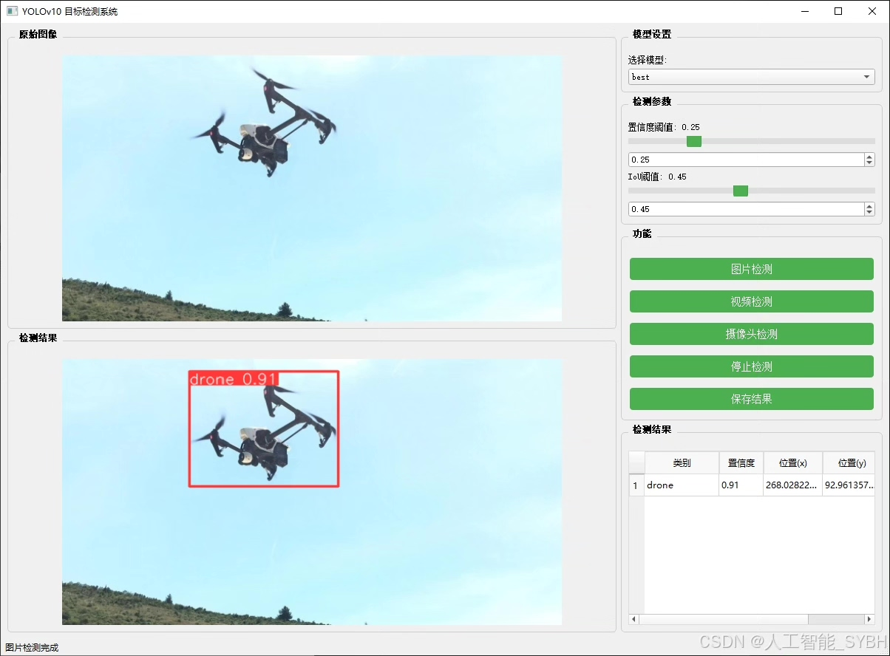
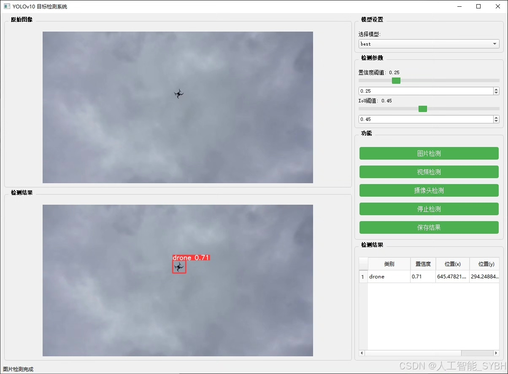
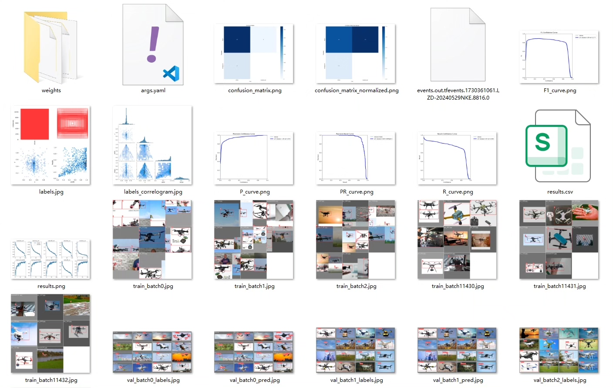
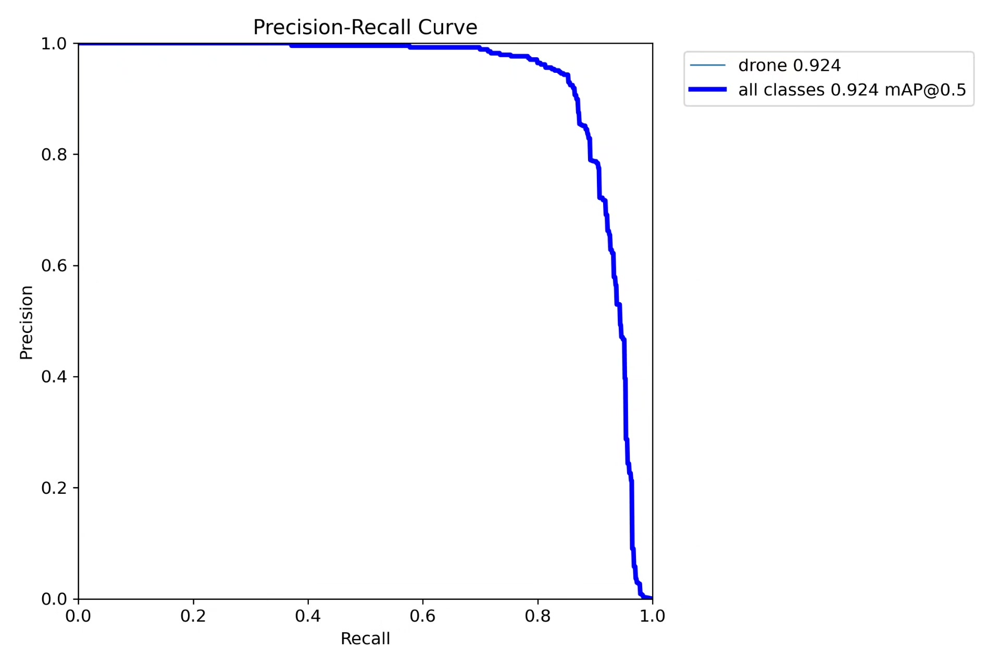
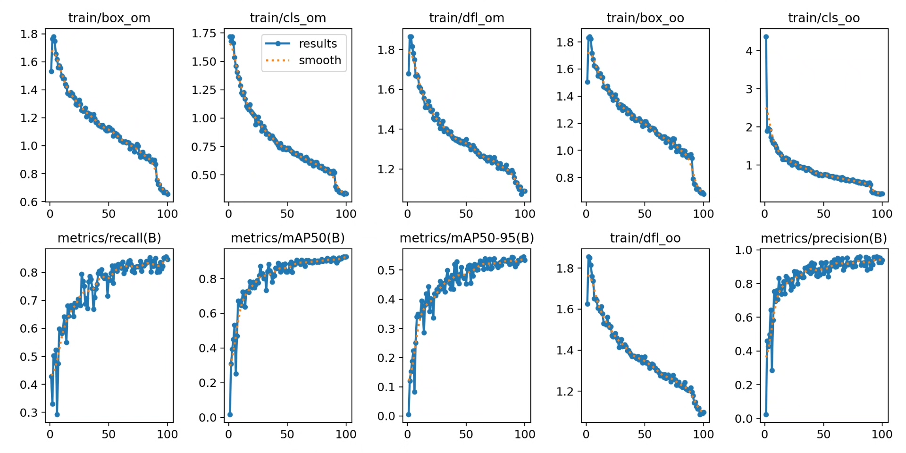
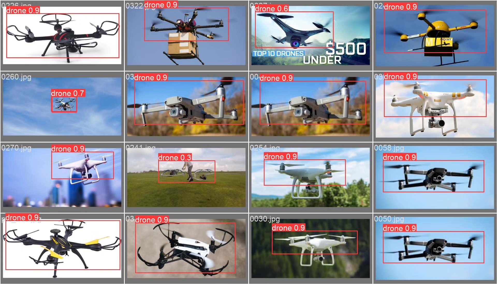
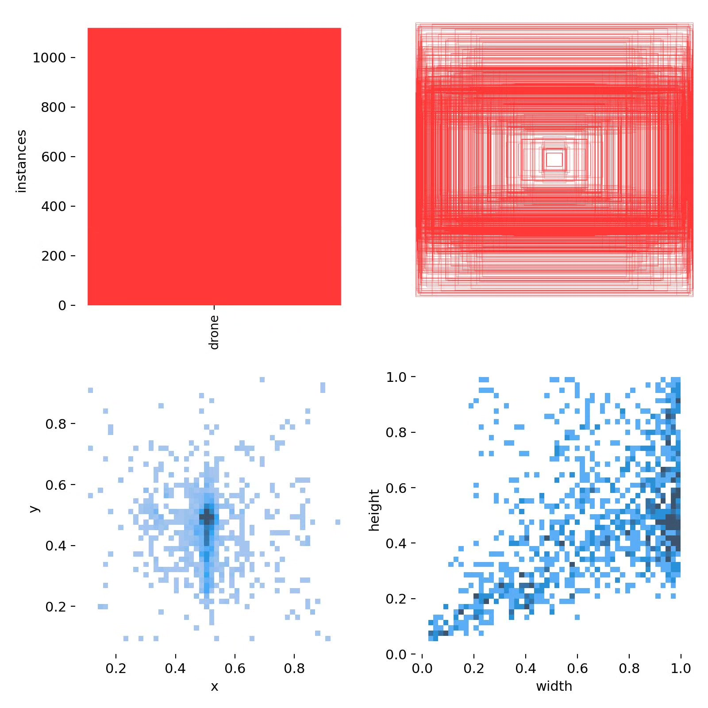
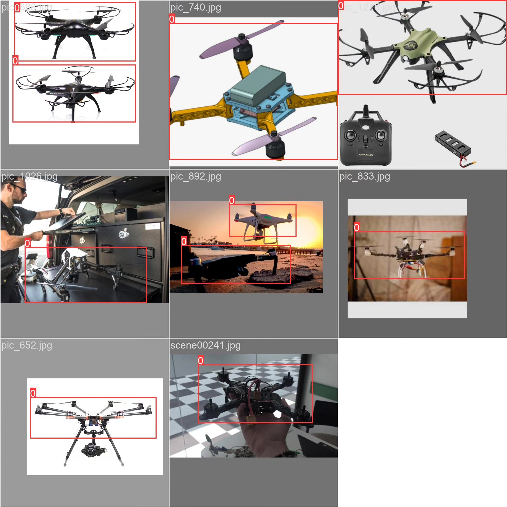

# UAV detection system based on YOLOv10 deep learning (YOLOv10+)

## Body

YOLOv10 Drone Detection System (YOLOv10+YOLO dataset + UI interface + Python project source code + model)

The YOLOv10 Drone Detection System is an intelligent system based on the YOLOv10 (You Only Look Once version 10) object detection algorithm, specifically designed for detecting and recognizing drones. This system can automatically identify and locate drones, suitable for scenarios such as airspace monitoring, drone management, and security surveillance. Through this system, users can detect the presence and location of drones in real-time, helping to maintain airspace safety, prevent illegal drone intrusions, and provide technical support for drone management.

The company's products have obtained the official commercial license certification from YOLO.

We offer after-sales service.

After payment, we will provide a WeChat account for instant questions and answers.

Environmental configuration: We will provide a tutorial on environmental configuration, and WeChat will provide答疑。

Remote installation service: If you need remote configuration, an additional fee of 69 is required, with all fees refunded if the configuration fails (only refund installation fees for older computers).

Retraining dataset: After configuring the environment, you can train on your own computer.
If you need us to retrain, just pay 69 plus computing power fees (2.5 yuan/hour).

Full after-sales service

## Images

## Payment

Here is a pay link on Stripe ( https://buy.stripe.com/3cs8yP7sY87d0vu9AB ). Please contact me lonlonago@foxmail.com after funding $89, and I will send you a complete data files , thank you!

